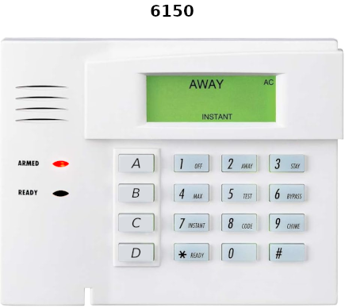
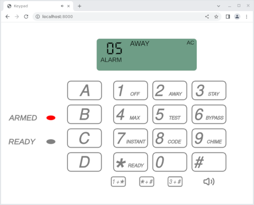
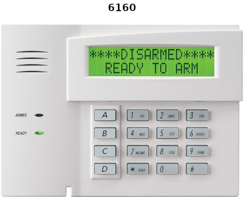
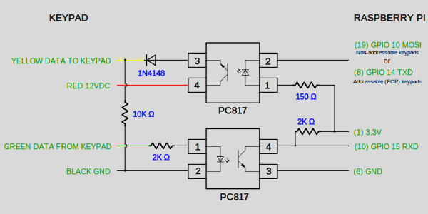

# Raspberry Pi interface to Honeywell/Ademco keypads and panels

This project allows a Raspberry Pi to connect to Honeywell/Ademco keypads
or panels.  Both addressable (Expanded Console Protocol - ECP) and
non-addressable protocols are are supported.







## Hardware

The Raspberry Pi is connected to either the keypad or the panel as depicted
in the appropriate schematic below. Optocouplers are used for isolation and
to shift the voltages and invert the signals.

Keypads and panels use a 4 wire interface:


| Keypad | Control Panel | Wire Color |
| :-: | :-: |:-: |
| &#9650; G | Data In (From Keypad) | Green |
| &minus; | &minus; Aux Pwr (GND) | Black |
| &plus; | &plus; Aux Pwr (12vdc) | Red |
| &#9660; Y | Data Out (To Keypad) | Yellow |

### Keypad connection



Be sure to use the correct Raspberry Pi transmit pin (MOSI or TXD)
depending on the type of keypad.

### Panel connection


For ECP panels an optional optocoupler enables the monitoring of data from
other devices such as keypads, RF sensors, zone expanders, etc.

Here's an example board to connect to an ECP panel (including logic
analyzer test points and optional optocoupler) that plugs directly onto a
Raspberry Pi.  This will work with either 26-pin or 40-pin GPIO headers.


Parts:
- [4x6cm board and connectors](https://www.amazon.com/gp/product/B07CK3RCKS)
- [Sockets](https://www.amazon.com/gp/product/B01MRZZCQU)
- [Optocouplers](https://www.amazon.com/gp/product/B01JG8EJVW)
- [Resistors](https://www.amazon.com/dp/B08FD1XVL6)
- [Diode](https://www.amazon.com/dp/B0C1V6Y8ND)

## Quick start

### Non-addressable Protocol

#### Raspberry Pi to keypad

The keypad address must be set to 31.  To set the keypad address, press the
[1] and [3] keys within 60 seconds of powering on the keypad.  Enter [0]
[0] to clear the current address and then enter [3] [1] [*] to set the
address to 31.

`pi2keypad` listens for commands on the specified UDP port.  Key presses
are sent back.  A command can be a sequence of either 4 or 8 bytes.  The 4
byte sequence will cause that [keypad message](#data-sent-to-the-keypad) to
be sent to the keypad continuously.  The 8 byte sequence will cause the
first 4 byte message to be sent once to the keypad and then the second 4
byte message to be sent continuously.

Compilation and execution:
```
gcc -Wall -O3 -o pi2keypad pi2keypad.c
sudo ./pi2keypad 1701 &
```

Display AWAY, INSTANT and AC with a red led.  Key press values will be
echoed:
```
printf "\x00\x00\x0c\x8c" | socat -t 999 udp:localhost:1701 - | hexdump -v -e '/1 "%02x\n"'
```

Beep 3 times and display AC with a green led.  Key press values will be
echoed:
```
printf "\x00\x03\x1c\x08\x00\x00\x1c\x08" | socat -t 999 udp:localhost:1701 - | hexdump -v -e '/1 "%02x\n"'
```

#### Raspberry Pi to panel

`pi2panel` listens for 1 byte [key values](#key-values) on the specified
UDP port.  4 byte [keypad status messages](#data-sent-to-the-keypad) are
sent back.  The client connection will timeout if a key press message is
not received every 60 seconds.  The special key press message `0xff` is
used as a wakeup/keepalive.

Compilation and execution:
```
gcc -Wall -O3 -o pi2panel pi2panel.c
sudo ./pi2panel 1701 &
```

Send the keepalive message and echo keypad status messages for 60 seconds:

```
printf "\xff" | socat -t 999 udp:localhost:1701 - | hexdump -v -e '4/1 "%02x "' -e '"\n"'
```

Arm the panel in away mode using the master security code `1234` and echo
keypad status messages for 60 seconds:

```
printf "\x01\x02\x03\x04\x02" | socat -t 999 udp:localhost:1701 - | hexdump -v -e '4/1 "%02x "' -e '"\n"'
```

### Addressable Protocol (ECP)

#### Raspberry Pi to ECP keypad

The keypad address must be set to one of the addressable keypad addresses
(16-23).  To set the keypad address to 16, for example, press the [1] and
[3] keys within 60 seconds of powering on the keypad.  Enter [0] [0] to
clear the current address and then enter [1] [6] [*] to set the address to
16.

`pi2ecp_keypad` listens on the specified UDP port for
[messages](#panel-data) to send to the keypad.  [Key press
messages](#keypad-keys-pressed) are sent back.

Compilation and execution:
```
gcc -Wall -O3 -o pi2ecp_keypad pi2ecp_keypad.c
sudo ./pi2ecp_keypad 1701 &
```

Send a [keypad control message](#keypad-control) that causes the keypad to
beep twice, turn on the green (READY) led, and display `hello` on the first
line and `world` on the second line.  [Key press
messages](#keypad-keys-pressed) will be echoed:
```
printf "\xf7\x00\x00\xff\x10\x00\x02\x10\x00\x00\x00\x00\x68\x65\x6c\x6c\x6f\x20\x20\x20\x20\x20\x20\x20\x20\x20\x20\x20\x77\x6f\x72\x6c\x64\x20\x20\x20\x20\x20\x20\x20\x20\x20\x20\x20\xec" | socat -u - udp-sendto:localhost:1701,sourceport=1234 && socat -u udp-recvfrom:1234,fork,reuseaddr system:'hexdump -Cv'
```

#### Raspberry Pi to ECP panel

The ECP panel interface is implemented as a kernel driver module.

##### Compilation

By default, the capability to receive device messages via the optional
optocoupler is enabled on GPIO 17.  To disable this capability or change
the GPIO number remove or edit `-DSOFT_UART=17` in `Makefile`.

```
make -C /lib/modules/$(uname -r)/build M=$(pwd) modules
dtc -@ -I dts -O dtb -o ademco_panel.dtbo ademco_panel.dts
```

##### Installation

- The following steps need to be done as `root`:
  - `raspi-config`
    - under `Interface Options->Serial Port`
      - `Would you like a login shell to be accessible over serial?` -> No
      - `Would you like the serial port hardware to be enabled?` -> Yes
  - `cp ademco_panel.dtbo /boot/overlays`
  - add `dtoverlay=ademco_panel` to `/boot/firmware/config.txt` under the
    `[all]` section.
  - `cp ademco.ko /lib/modules/$(uname -r)/kernel/drivers/char`
  - `depmod`
  - add `ademco` to `/etc/modules` to load the module at boot
  - `reboot`

##### Daemon

`ademcod` listens on the specified UDP port for key press messages to send
to the panel. A key press message consists of the keypad address followed
by [key values](#key-values).  The client connection will timeout if a key
press message is not received every 60 seconds.  The special key press
message `0xff` is used as a wakeup/keepalive.  Panel
[messages](#panel-data) are sent back.  Each received panel message is
prefaced with a channel number.  Channel 0 has messages from the panel.
Channel 1 (if enabled with the `SOFT_UART` define when building the module)
has messages from other devices.

Running the daemon:
- `sudo ./ademcod 1701 &`

Arm the panel in away mode using keypad address 16 with master security
code `1234` and echo panel messages for 60 seconds:

```
printf "\x10\x01\x02\x03\x04\x02" | socat -u - udp-sendto:localhost:1701,sourceport=1234 && socat -u udp-recvfrom:1234,fork,reuseaddr system:'hexdump -Cv'
```

`ademcod.service` is provided to allow `ademcod` to be controlled by
`systemd`.  To use it, execute the following commands as root:

- `cp ademcod.service /etc/systemd/system`
- `systemd enable ademcod`
- `systemd start ademcod`

Edit `ademcod.service` to change the UDP port number.

##### MQTT Daemon

`alarmmqtt` provides an [MQTT](https://mqtt.org) interface to the panel.
See the source code for the supported topics.  `alarmmqtt` requires the
[Net::MQTT::Simple](https://metacpan.org/pod/Net::MQTT::Simple) Perl module.

## Keypad GUI

The `keypad` application provides a web-based UI for the keypad.  It
communicates with `pi2panel` in non-addressable mode and `ademcod` in
addressable mode.  By default it uses the non-addressable protocol.  To use
the addressable protocol (ECP), specify the `-ecp` option with a keypad
address.  Other arguments are the TCP port to use for the HTTP connection
(a WebSocket connection will be made on the HTTP port + 1) and the hostname
and port of the panel server.  The `-wshost` option may be used to specify
a hostname if the WebSocket host cannot be determined from the http
connection (e.g. when running under podman).

Like an actual keypad, the function keys (A-D) must be held for at least 2
seconds to prevent accidental activation.  Key pairs may be activated by
pressing the desired key pair key at the bottom of the keypad.  Keypad
audio is supported and may be muted by clicking the speaker icon.

Non-addressable protocol:

```
./keypad 8000 localhost:1701
```

Addressable protocol:

```
./keypad -ecp 16 8000 localhost:1701
```

Connect to the keypad in a web browser using the url `http://localhost:8000`.

`keypad` may be run on a host other than the Raspberry Pi.

## Protocol

A [HiLetgo USB Logic Analyzer](https://www.amazon.com/dp/B077LSG5P2) and
[PulseView](https://sigrok.org/wiki/PulseView) were used to analyze the
protocols.

The traces below are from the Pi's perspective and are the inverse of what
actually appears on the bus.

Two different protocols are used for non-addressable mode and addressable
(ECP) mode.

### Non-addressable Protocol

The keypad expects to receive a 17ms sync pulse every 176ms.  Data for the
keypad is sent between the pulses.  A data packet consists of a 6ms high
pulse followed by 6ms low then 4 bytes of 2400 baud 8 bit even parity data.
Each byte is preceded by a 1ms pulse.  There's a final 1ms pulse after the
last byte.

The keypad transmits key presses during the 17ms sync pulse.  Each press is
sent as 3 bytes of 2400 baud 5 bit even parity data.  The 3 bytes
contain the same value and indicate the key (or key combination) that was
pressed.


This trace shows the 17ms sync pulses within the 176ms frames.  One frame
contains data sent to the keypad from the panel and another has data sent
from the keypad to the panel.

#### Data sent to the keypad


Here, the panel has sent the data `d1 00 1c 08`.  The initial `00` is due
to the 6ms pulse.  The final `00` is due to the 1ms pulse at the end of the
data.  The 17ms sync pulse also produces a `00` byte.

Data sent to the keypad controls the keypad beeps/tones, leds and displayed
status.  The control data consists of 4 bytes:

##### Control Bytes

##### Byte 0 - Two digit hex display*

| Bit | Description |
| :-: | ----------- |
| 0-7 | Two digit hex display (00-EF, F1, FC) |
|     | F0, F2-FB, FD-FF cause the entire message to be ignored |

##### Byte 1 - beep control and status

| Bit | Description |
| :-: | ----------- |
| 0-2 | &nbsp;&nbsp; 0: silent |
|     | &nbsp;&nbsp; 1: one beep |
|     | &nbsp;&nbsp; 2: two beeps |
|     | &nbsp;&nbsp; 3: three beeps |
|     | &nbsp;&nbsp; 4: fast beeps |
|     | &nbsp;&nbsp; 5/6: two slow beeps |
|     | &nbsp;&nbsp; 7: continuous beep |
|  3  | increase beep volume |
|  4  | NIGHT* |
|  5  | CANCELED* |
|  6  | fast beeping (bits 0-3 must be 0) |
|     | suppresses all status/leds - displays 1C |
|  7  | ? |

##### Byte 2 - beep and status

| Bit | Description |
| :-: | ----------- |
|  0  | 3 slow beeps |
|  1  | CHECK* |
|  2  | disable low digit* |
|  3  | disable high digit* |
|  4  | green (READY) led |
|  5  | FIRE* |
|  6  | BAT* |
|  7  | STAY*/red (ARMED) led |

##### Byte 3 - tone and status

| Bit | Description |
| :-: | ----------- |
|  0  | oscillating tones |
|  1  | ALARM* |
|  2  | AWAY*/red (ARMED) led |
|  3  | AC* (disable NO AC) |
|  4  | BYPASS* |
|  5  | CHIME* |
|  6  | disable NOT READY* |
|  7  | INSTANT* |

*Used by 6150 only

On the 6150 keypad, the `NOT READY` status will be displayed unless the red
(ARMED) or green (READY) led is on or the ALARM bit, CHECK bit or disable
NOT READY bit is set.

#### Data received from the keypad


In this trace the keypad is sending key press data during the 17ms sync
pulse.

The keypad sends 3 bytes of data to indicate a key press.  The bytes all
contain the same value and indicate the key (or key combination) that was
pressed.  The function keys (A - D) need to be held for 2 seconds.  The
keys and their associated values (in hex) are as follows.

##### Key values

|           |     |     |     |     |     |     |     |     |     |     |
|   :-:     | :-: | :-: | :-: | :-: | :-: | :-: | :-: | :-: | :-: | :-: |
|  **Key**  | 0   | 1   | 2   | 3   | 4   | 5   | 6   | 7   | 8   | 9   |
| **Value** | 00  | 01  | 02  | 03  | 04  | 05  | 06  | 07  | 08  | 09  |
|           |     |     |     |     |     |     |     |     |     |     |
|           |     |     |     |     |     |     |     |     |     |     |
|  **Key**  | *   | #   | 1+* | *+# | 3+# | A   | B   | C   | D   |     |
| **Value** | 0A  | 0B  | 0C  | 0D  | 0E  | 1C  | 1D  | 1E  | 1F  |     |

### Addressable Protocol (ECP)

In the addressable protocol the panel is the bus controller and specifies
when devices may send data.  The panel sends data in cyclic 330ms frames.


#### Device status

The frame start is indicated by a 13ms pulse.  Following this pulse,
devices send 3 bytes to indicate if they have data to send.  The first byte
is sent after the falling edge of the 13ms start-of-frame pulse.  Each
subsequent byte is sent after the falling edge of a 1ms sync pulse.  The 3
bytes comprise a bitmask of device addresses with the bit number
corresponding to the device address.  Bit 0 is the LSB of the first byte
and bit 23 is the MSB of the last byte.  If a device has data to send it
will set its device address bit to 0.  Keypads use device addresses 16-23.

The 3 bytes are 4800 baud, 8-bits, no parity, 1 stop bit.  All subsequent
serial data in the frame has even parity.


In this trace, the keypad device with address 17 is indicating it has data
available.

#### Device query

If a device indicates that it has data to send, the panel will query the
device for the data.  The panel query consists of a 4ms pulse followed by
two data bytes - an 0xF6 and the address of the device being queried.

| Byte  | Description |
| :-:   | ----------- |
| 0     | 0xF6 |
| 1     | device address |

The queried device then responds with a device response message.  The first
byte of the device response message contains a sequence number and the
address of the responding device.  The sequence number increments after
each acknowledged device response message.

| Byte  | Description |
| :-:   | ----------- |
| 0     | sequence number and device address |
|       | &nbsp;&nbsp; bits 0-5: device address |
|       | &nbsp;&nbsp; bits 6-7: sequence number|
| 1     | number of bytes to follow |
| 2-n   | data values |
| n     | [checksum](#checksums) |

Finally, the panel sends an acknowledge that the device response message
was received.  The acknowledge consists of a single byte with the sequence
number and address of the device response message being acknowledged.  A
device will continuously send its response message until the panel
acknowledges it.


In this trace, the panel is querying device address 17.  The device
responds with its address and sequence number 1 (0x51) and the queried data.
The panel then acknowledges receipt of the message.

#### Panel data

The panel may also send a variety of other messages as described below.

##### Keypad control

| Byte  | Description |
| :-:   | ----------- |
| 0     | 0xF7 |
| 1-3   | destination device address bitmask |
|       | &nbsp;&nbsp; Each bit corresponds to a device address |
|       | &nbsp;&nbsp; Bit 0 is the LSB of the first byte |
|       | &nbsp;&nbsp; Bit 23 is the MSB of the last byte |
| 4     | unknown |
| 5-8   | [control and status](#control-bytes) |
| 9     | Bit 0 - programming mode enabled |
|       | &nbsp;&nbsp; Enabled when in programming mode and panel is |
|       | &nbsp;&nbsp; prompting for data entry |
| 10    | Prompt position (0-31) |
|       | &nbsp;&nbsp; Display a cursor prompt at the specified |
|       | &nbsp;&nbsp; character position on the LCD |
| 11    | unknown |
| 12-27 | LCD line one (16 chars) |
|       | &nbsp;&nbsp; MSB set on first byte enables LCD backlight |
| 28-43 | LCD line two (16 chars) |
| 44    | [checksum](#checksums) |
| 45-48 | Pad bytes |

##### F2

| Byte  | Description |
| :-:   | ----------- |
| 0     | 0xF2 |
| 1     | number of bytes to follow |
| 2-6   | unknown |
| 7     | bits 0-2 - counter |
|       | bits 3-7 - unknown |
| 8-n   | unknown |
| n     | [checksum](#checksums) |

##### F8

| Byte  | Description |
| :-:   | ----------- |
| 0     | 0xF8 |
| 1-7   | unknown |
| 8     | [checksum](#checksums) |

#### Device data

Messages sent by devices.

##### Keypad power on

| Byte  | Description |
| :-:   | ----------- |
| 0     | sequence number and device address |
|       | &nbsp;&nbsp; bits 0-5: device address |
|       | &nbsp;&nbsp; bits 6-7: sequence number |
| 1     | 0x87 |
| 2-7   | unknown |
| 8     | [checksum](#checksums) |

Keypads send this message after power on.

##### Keypad keys pressed

| Byte  | Description |
| :-:   | ----------- |
| 0     | sequence number and device address |
|       | &nbsp;&nbsp; bits 0-5: device address |
|       | &nbsp;&nbsp; bits 6-7: sequence number |
| 1     | number of bytes to follow |
| 2-n	| [keys](#key-values) |
| n     | [checksum](#checksums) |

##### 5800 series RF status

| Byte  | Description |
| :-:   | ----------- |
| 0     | 0x5x (bits 0-4 seem to be 0 or 5) |
| 1     | bits 0-3: serial number bits 16-19 |
|       | bits 4-7: unknown (seems to be 8) |
| 2 - 3 | big-endian serial number bits 0-15 |
| 4     | state |
|       | &nbsp;&nbsp; bit 0: unknown |
|       | &nbsp;&nbsp; bit 1: low battery |
|       | &nbsp;&nbsp; bit 2: supervision required |
|       | &nbsp;&nbsp; bit 3: unknown |
|       | &nbsp;&nbsp; bit 4: loop 3 state |
|       | &nbsp;&nbsp; bit 5: loop 2 state |
|       | &nbsp;&nbsp; bit 6: loop 4 state |
|       | &nbsp;&nbsp; bit 7: loop 1 state |
| 5     | [checksum](#checksums) |

#### Checksums

A checksum is the two's complement of the sum of the preceding bytes.  The
sum of all the bytes in a message including the checksum should be 0.

## Implementation

### Non-addressable Protocol

#### Pi to keypad

Receiving from the keypad uses the UART set to 2400 baud, 5 data bits, even
parity 1 stop bit.

It was not possible to use the UART for transmission to the keypad due to
the sync pulses and other timing requirements.  Because Linux is not a
realtime operating system the lack of consistent timing prevented
bit-banging the sync pulses and serial data from working.  Fortunately, the
Raspberry Pi has a built-in device that can send an arbitrary serial bit
stream with rigid timing - SPI.

To avoid the non-realtime OS issues, the SPI device is fed using DMA.  The
SPI DMA is triggered by the PWM device.

Access to the peripherals is provided via `/dev/mem` and the `mmap()`
function.

Thanks to [Jeremy Bentham](https://iosoft.blog) for his articles on
[Raspberry Pi DMA programming in
C](https://iosoft.blog/2020/05/25/raspberry-pi-dma-programming) and
[Streaming analog data from a
Raspberry Pi](https://iosoft.blog/2020/11/16/streaming-analog-data-raspberry-pi).

Additional information came from the [BCM2835 ARM
Peripherals document](https://www.raspberrypi.org/app/uploads/2012/02/BCM2835-ARM-Peripherals.pdf) and its [errata](https://elinux.org/BCM2835_datasheet_errata).
Information on the PWM clocks came from [BCM2835 Audio Clocks](https://www.scribd.com/doc/127599939/BCM2835-Audio-clocks).

The minimum SPI frequency is greater than 2400 kHz so the SPI clock is set
to 4800 kHz and the bits in the keypad message are doubled to produce 2400
baud.

##### DMA Configuration

All the memory used for DMA is allocated uncached using the VideoCore
graphics processor
[mailbox](https://github.com/raspberrypi/firmware/wiki/Mailbox-property-interface)
interface.

The DMA controller is driven by *Control Block* (CB) structures.  The CBs may
be linked to form a chain of DMA requests.

3 DMA channels are used:

* PWM request to trigger the SPI operation
* SPI receive
* SPI transmit

The PWM device is configured to request a DMA operation every 176ms.  3 CBs
are chained to:

* feed dummy data to the PWM device
* write the SPI DLEN register
* write the SPI CS register to trigger the SPI operation

The SPI receive DMA channel has a single CB that reads (and throws away)
data from the SPI FIFO.

The SPI transmit DMA channel is where most of the work happens.  There are
2 types of frames that are being sent.  One has the 17ms sync pulse and no
other data.  The other has the 17ms sync pulse and the 4 bytes of data for
the keypad.  The frame with the keypad data is sent every 11th frame.  So
there are 10 frames containing just the sync pulse and the 11th contains
the sync pulse and the keypad data.

To prevent potential glitches when updating the keypad data, two
*ping-pong* buffers are used for the data.  One buffer contains the
currently active data.  When the data needs to change, the inactive buffer
is updated and then swapped in to become active.

The 10th DMA CB (**LINK CB**) points to a CB that will copy a frame
containing the sync pulse and keypad data.  To swap in the new keypad data
the next field of the **LINK CB** is altered to point to the appropriate
**PING** or **PONG** CB.

To send a particular keypad message once and then send another message
continuously, the one-time message is written to the *once* buffer and the
continuous message is written to the inactive *ping* or *pong* buffer.
Then the **LINK CB** next value is pointed to the appropriate **PING** or
**PONG CB**.  That value gets written to the **LINK CB** field by the CB
linked from the **ONCE CB**.

Graphically, the DMA channel configuration looks like this:


#### Pi to panel

The UART is used for transmission to and reception from the panel.  One
GPIO pin is also connected to the received data to detect the frame sync
pulses.

To transmit a key press, a GPIO interrupt is configured to trigger on the
rising edge of the received data.  The frame sync pulse is detected by
looking for a rising edge that occurs after about a frame width (176ms)
from the previous rising edge.  Once the sync pulse is detected the UART is
configured for 5-bit data and the key press data is sent.  Then the UART is
restored to 8-bit data.

The keypad status data is read from the UART with the extraneous zero bytes
caused by the sync pulses discarded.

### Addressable Protocol (ECP)

#### Pi to ECP keypad

The UART is used for both transmitting and receiving keypad data.  Sync
pulses are generated using ioctls to set and clear the BREAK signal.

#### Pi to ECP panel

The ECP panel interface is implemented as a kernel driver module.  The
driver uses the Serial Device Bus (SERDEV) to access the UART.  An
additional GPIO is used to generate interrupts on the falling edge of
received serial data.  This allows for precise synchronization.  The UART
and GPIO are configured via a [Device Tree
Overlay](https://hubtronics.in/learn/device-tree-overlay-spi).  The driver
instantiates `/dev/ademco_panel` that is used to read panel data and write
keypad key data.  The read data is a raw byte stream of data received from
the panel. The write data consists of a length byte indicating the total
length of the message (including the length byte) followed by the keypad
address and the [key value](#key-values) data.

Since many Pi models only support a single UART, the optional capability to
monitor other devices is implemented using a GPIO and software timers and
interrupts to read the serial data.  If enabled, `/dev/ademco_devices` is
created.  The read data is a raw byte stream of data received from the
devices.  This includes any keypad key data sent via `/dev/ademco_panel`.

`ademcod` provides a UDP interface to the devices.  See the
[description](#daemon) above.


## License

_Licensed under the MIT License, Copyright (c) 2024 Greg Renda_
